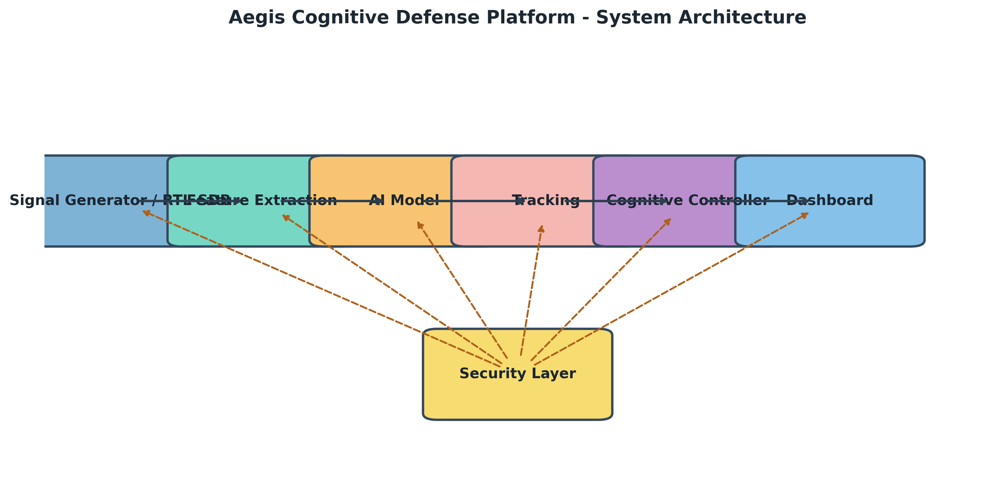

# Aegis Cognitive Defense Platform

> Multi-input cognitive photonic radar research stack for threat sensing, electronic warfare resilience, and explainable AI analysis.

## Research Motivation
Modern contested electromagnetic environments demand radar systems that can reason about targets, adapt to interference, and preserve decision transparency. This repository investigates:
- **Cognitive Sensing:** Feedback loops that couple multi-modal AI inference with waveform control.
- **Photonic Radar:** Broadband, low-jitter signal chains capable of capturing rich micro-Doppler signatures.
- **Secure Operations:** Authentication, tamper detection, and electronic warfare countermeasures designed for mission assurance.
- **Explainability for Operators:** Grad-CAM visualizations, structured metrics, and audit trails that make AI-driven decisions defensible to analysts.

## System Architecture Overview


1. **Signal Generation & Reception** – Synthetic photonic or RTL-SDR inputs created via `src/signal_generator.py` and `src/rtl_sdr_receiver.py`.
2. **Feature Extraction** – Range-Doppler maps, micro-Doppler spectrograms, and photonic metadata assembled in `src/feature_extractor.py`.
3. **AI Inference** – Multi-input PyTorch model (`src/model_pytorch.py`) combines spatial tensors with metadata for classification.
4. **Tracking & Cognitive Control** – Multi-target Kalman tracker (`src/tracker.py`), cognitive controller (`src/cognitive_controller.py`), and EW defenses (`src/ew_defense.py`).
5. **Explainability & Research Metrics** – Grad-CAM (`src/xai_pytorch.py`), metrics JSON, ROC/PR/CM figures, and Streamlit dashboards (`app.py`).

Run `python scripts/generate_system_architecture_diagram.py` to regenerate the figure if you modify the pipeline.

## Repository Layout
| Path | Purpose |
| --- | --- |
| `run_experiment.py` | Unified CLI orchestrator that loads YAML configs, seeds everything, and saves artifacts. |
| `app.py` | Streamlit research console with analytics, XAI, photonic parameters, research metrics, and admin tabs. |
| `src/` | Core modules (detection, tracking, cognitive control, EW defense, training, demo scenarios). |
| `experiments/` | Versioned YAML configurations describing datasets, training, and evaluation schedules. |
| `scripts/` | Thin compatibility wrappers (e.g., architecture diagram runner) that shell out to `tools/`. |
| `tools/` | Research utilities such as the Matplotlib system architecture diagram generator. |
| `outputs/` | Canonical copy of the latest reports, plots, and checkpoints for publication snapshots. |
| `results/` | Full experiment-specific checkpoints, logs, figures, and databases produced during runs. |
| `docs/figures/` | Publication-ready visuals. |

## Dataset Description
The platform works with both synthetic and real radar datasets:
- **Synthetic Benchmarks:** Rapid experimentation with controlled SNR, micro-Doppler, and multipath via `src/signal_generator.py`.
- **Real/Fused Data:** Import radar cubes or IQ captures through `src/data_preprocessing.py` and `src/dataset_reporting.py` for normalization, class balancing, and metadata extraction.
- **Dataset Reporting:** `src/dataset_report.py` exposes `generate_dataset_report(...)`, the helper used by the experiment runner to emit text/CSV summaries, plots, and JSON statistics directly into `outputs/reports/` and `outputs/plots/`.

Document every dataset with `generate_dataset_report(...)` (or the built-in call inside `run_experiment.py`) so each publication has sample counts, SNR distributions, and per-class metrics captured alongside the code.

## Experiment Reproducibility Instructions
1. **Environment Setup**
   ```bash
   python -m venv .venv
   source .venv/bin/activate
   pip install --upgrade pip
   pip install -r requirements.txt
   export PYTHONPATH=$PYTHONPATH:$(pwd)
   ```
2. **Configuration Control**
   - Create or edit YAMLs under `experiments/` to describe datasets, training loops, devices, and evaluation batch sizes.
   - Version-control those configs (or tag releases) so each figure/table maps to a specific file.
3. **Determinism**
   - `run_experiment.py` seeds Python, NumPy, PyTorch CPU/GPU, and cuDNN flags before preprocessing.
   - Legacy entry points (`src/train.py`, `src/train_pytorch.py`) retain their own seeding helpers if you invoke them directly.
4. **Metadata Logging**
   - Each experiment run writes `experiment.log`, metrics JSON, training history, and plots under a timestamped folder inside `outputs/experiments/`.
   - The runner mirrors the latest metrics/history/plots/models into `outputs/` so papers always cite the canonical snapshot.

## Evaluation Methodology
- **Classification Metrics:** `outputs/reports/metrics.json` stores accuracy, macro/weighted precision, recall, F1, ROC-AUC, and confusion matrices. Corresponding plots are saved in `results/reports/` (`confusion_matrix.png`, `roc_curve.png`, `precision_recall.png`).
- **Training Dynamics:** `results/training_history.json` plus `results/reports/training_history.png` capture convergence behavior.
- **Tracking Quality:** `results/reports/tracking_rmse.png` quantifies positional errors across simulated trajectories.
- **EW Robustness:** Jamming and spoofing demos (`src/demo_scenarios.py`) provide qualitative and quantitative timelines for cognitive responses.
- **Explainability:** Grad-CAM overlays rendered through the Streamlit XAI tab serve as qualitative validation artifacts.

## How to Run Experiments
1. **Unified Experiment Runner (recommended)**
   ```bash
   python run_experiment.py --config experiments/dev_smoke.yaml
   ```
   Swap in your own YAML (for example `experiments/baseline.yaml`) to change datasets, batch sizes, devices, or logging levels. Each invocation seeds all libraries, builds dataset reports, trains, evaluates, and mirrors artifacts into both `outputs/experiments/<name_timestamp>/` and the canonical `outputs/` folder.

2. **Dataset Report Only**
   If you need a standalone dataset audit outside the full pipeline, call the helper directly:
   ```bash
   python - <<'PY'
   import numpy as np
   from src.dataset_report import generate_dataset_report

   signals = np.random.randn(32, 4, 64, 64)  # replace with your tensors
   labels = np.random.randint(0, 4, size=32)
   artifacts = generate_dataset_report(signals, labels)
   print(f"Text summary saved to {artifacts.text_summary}")
   PY
   ```

3. **Standalone Training Entrypoints**
   - PyTorch only:
     ```bash
     python src/train_pytorch.py
     ```
   - Legacy Keras/TensorFlow:
     ```bash
     python src/train.py
     ```
   These scripts remain for backwards compatibility but do not capture the full reporting pipeline by default.

4. **Research Console (Streamlit)**
   ```bash
   streamlit run app.py
   ```
   Use the "Research Metrics" tab to inspect the latest artifacts under `outputs/`, and trigger demo scenarios from the Live Operations tab.

5. **System Architecture Visualization**
   ```bash
   python scripts/generate_system_architecture_diagram.py --output docs/figures/system_architecture.png
   ```

## Citation
If you build upon this work, please cite it as:

```bibtex
@misc{aegis2026cognitive,
  title        = {Aegis Cognitive Defense Platform},
  author       = {Nikhil and Contributors},
  year         = {2026},
  howpublished = {GitHub repository},
  url          = {https://github.com/<org>/aegis-cognitive-defense-platform}
}
```

---
For questions, open an issue or contact the maintainers listed in `users.json`. Contributions that improve datasets, EW modeling, or explainability are especially welcome.
